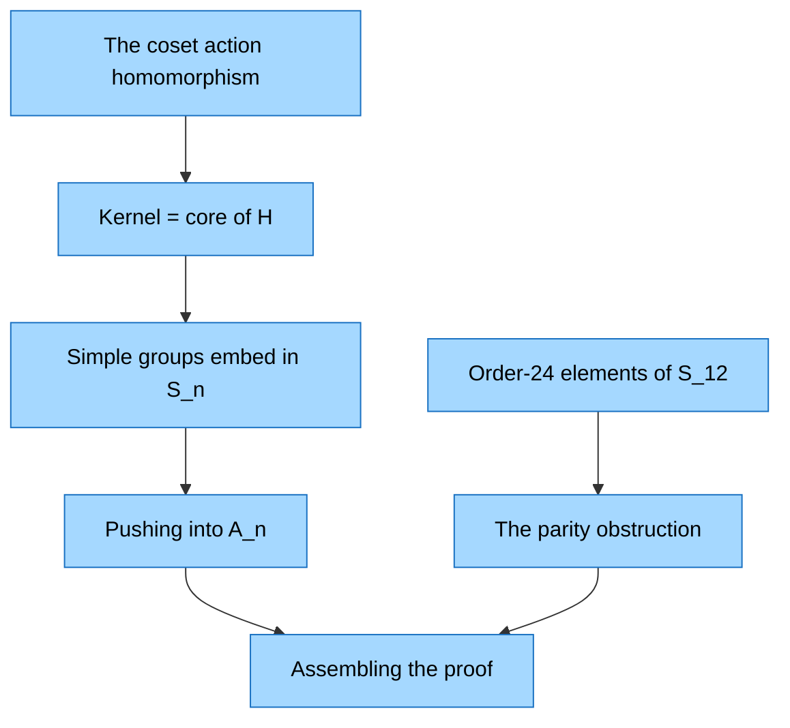

# Learning Session: Proving non-simplicity via coset actions

- **Session:** `group-nonsimplicity`
- **Started:** 2026-08-23 09:08 UTC
- **Phase:** done
- **Background:** Actively studying group theory; working on: $G$ has an element of order 24 and a subgroup of index 12, prove $G$ is not simple.

## Knowledge Probe

### Q1. Order of a permutation — correct
In $S_{10}$, what is the order of the permutation $\sigma = (1\,2\,3\,4)(5\,6\,7\,8\,9\,10)$ (a 4-cycle and a 6-cycle, disjoint)?

- **A.** 24 (the product $4 \cdot 6$)
- **B.** 12 (the lcm of 4 and 6)
- **C.** 10 (the sum $4+6$)
- **D.** 6 (the longest cycle length)

> **Answer:** B
> Right: disjoint cycles commute, so the order is $\mathrm{lcm}(4,6)=12$.

### Q2. Group actions — correctmanager/#/contest
A group $G$ acts on a set $X$, giving a homomorphism $\varphi: G \to \mathrm{Sym}(X)$. What is $\ker \varphi$?

- **A.** $\{g \in G : g\cdot x = x \text{ for all } x \in X\}$
- **B.** $\{g \in G : g\cdot x = x \text{ for some } x \in X\}$
- **C.** $\{x \in X : g\cdot x = x \text{ for all } g \in G\}$
- **D.** $\mathrm{Stab}(x)$ for a chosen $x \in X$

> **Answer:** A
> Right: the kernel is exactly the elements that act trivially on every point of $X$.

### Q3. Action on cosets — incorrect
Let $H \le G$ with $[G:H] = n$. $G$ acts on the left cosets $G/H$ by left multiplication, giving $\varphi: G \to S_n$. Which statement about $\ker \varphi$ is always true?

- **A.** $\ker\varphi$ is the largest normal subgroup of $G$ contained in $H$
- **B.** $\ker\varphi = H$
- **C.** $\ker\varphi = \{e\}$, so $G$ always embeds in $S_n$
- **D.** $\ker\varphi = Z(G)$

> **Answer:** B
> Not quite: $H$ fixes $eH$ but generally moves other cosets; the kernel is $\bigcap_g gHg^{-1}$, the core of $H$ — the largest normal subgroup of $G$ inside $H$, equal to $H$ only when $H \trianglelefteq G$.

**Knowledge boundary:** knows up to *Group actions*; learning starts at *Action on cosets*

## Learning Plan

> **Verifier notes:** Verifier confirmed all 7 planned concepts: coset action is well-defined and transitive; kernel = core of $H$ (largest normal subgroup inside $H$); simple $G$ embeds in $S_n$, and in $A_n$ once $|G| > 2$; the unique cycle type of order 24 in $S_{12}$ is $(8,3,1)$, which is odd, so $A_{12}$ has no element of order 24; the assembled chain is a complete, gap-free proof, valid for infinite $G$ as well.

**Progress:** 7/7 concepts

## Lessons

### 1. The coset action homomorphism
Let $H \le G$ with $[G:H] = n$, and let $X = G/H = \{xH : x \in G\}$ be the set of left cosets — a set with exactly $n$ elements. The one new idea: **$G$ acts on this set by left multiplication**, $g \cdot (xH) = (gx)H$.

This is well-defined: if $xH = yH$, then $y = xh$ for some $h \in H$, so $(gy)H = (gxh)H = (gx)H$ — the result doesn't depend on which representative of the coset you picked. The action axioms are immediate from associativity: $e\cdot(xH) = xH$ and $(g_1g_2)\cdot(xH) = g_1\cdot(g_2\cdot(xH))$.

An action of $G$ on a set $X$ is the same thing as a homomorphism $G \to \mathrm{Sym}(X)$; here $|X| = n$, so we get $\varphi: G \to S_n$. The action is even transitive: $yx^{-1}$ sends $xH$ to $yH$.

Punchline: *a subgroup of index $n$ — by itself, with no other hypotheses — manufactures a homomorphism $G \to S_n$.* Homomorphisms have kernels, and kernels are normal. This is the door through which "$H$ has index 12" will become "$G$ has a normal subgroup."

**Check:** In the coset action $g\cdot(xH) = (gx)H$, why is the result independent of the chosen representative $x$?
- **A.** If $xH = yH$ then $y = xh$ with $h \in H$, and $(gxh)H = (gx)H$ since $h \in H$
- **B.** Because $gH = Hg$ for all $g$
- **C.** Because $H$ is a normal subgroup of $G$
- **D.** Because all cosets have the same cardinality

> **Answer:** A — *passed*
> Correct: $h$ absorbs into $H$ on the right, which works for any subgroup — normality is never needed.

### 2. Kernel = core of H
Which $g \in G$ act trivially on every coset? $g \in \ker\varphi$ iff $(gx)H = xH$ for all $x$, and $(gx)H = xH \iff x^{-1}gx \in H \iff g \in xHx^{-1}$. Requiring this for every $x$:
$$\ker\varphi = \bigcap_{x \in G} xHx^{-1} =: \mathrm{Core}_G(H),$$
the **normal core** of $H$.

Two formal consequences: (1) $\mathrm{Core}_G(H) \subseteq H$ (take $x = e$); (2) it is the **largest** normal subgroup of $G$ contained in $H$ — normal because it is a kernel, largest because any $N \trianglelefteq G$ with $N \subseteq H$ satisfies $N = xNx^{-1} \subseteq xHx^{-1}$ for all $x$.

Payoff: for proper $H$, $\ker\varphi \subseteq H \subsetneq G$, so the kernel is automatically a normal subgroup $\neq G$; only its possible triviality remains in question.

**Check:** Let $G = S_3$ and $H = \langle(1\,2)\rangle$ (index 3). What is $\mathrm{Core}_G(H) = \bigcap_x xHx^{-1}$?
- **A.** $\{e\}$
- **B.** $H$ itself
- **C.** $A_3$
- **D.** $S_3$

> **Answer:** A — *passed*
> Correct: the conjugates $\langle(1\,2)\rangle, \langle(1\,3)\rangle, \langle(2\,3)\rangle$ intersect trivially, so the coset action embeds $S_3$ into $S_3$.

### 3. Simple groups embed in S_n
Suppose $G$ is simple and $H \le G$ is proper of finite index $n > 1$. $\ker\varphi \trianglelefteq G$, so simplicity leaves $\ker\varphi = G$ or $\ker\varphi = \{e\}$. The first is impossible: $\ker\varphi = \mathrm{Core}_G(H) \subseteq H \subsetneq G$. Hence $\varphi$ is injective and $G$ is isomorphic to a subgroup of $S_n$.

Consequences: injectivity preserves element orders, so every element order in $G$ must occur in $S_n$; and for finite $G$, Lagrange gives $|G| \mid n!$. Either can yield a contradiction, which then refutes simplicity itself.

**Check:** Can a simple group of order 60 have a subgroup of index 4?
- **A.** No — the coset action would embed it into $S_4$, which has only $24 < 60$ elements
- **B.** Yes — Lagrange allows a subgroup of order 15, and that is the only constraint
- **C.** No — a simple group has no proper nontrivial subgroups at all
- **D.** Yes — the kernel of the coset action could be all of $G$, avoiding the embedding

> **Answer:** A — *passed*
> Correct: $60 \nmid 24$, so no injection into $S_4$ exists; this is why $A_5$ has no subgroup of order 15.

### 4. Pushing into A_n
Step 3 left open whether $\varphi(G)$ contains odd permutations. Compose with the sign homomorphism: $\psi = \mathrm{sgn}\circ\varphi: G \to \{\pm 1\}$. Then $\ker\psi \trianglelefteq G$, so simplicity gives $\ker\psi = G$ or $\{e\}$. If $\ker\psi = \{e\}$, $\psi$ is injective and $|G| \le 2$ — impossible ($24 \mid |G|$). Hence $\ker\psi = G$: every $\varphi(g)$ is even, i.e. $\varphi(G) \subseteq A_n$.

Upgrade: **a simple group with $|G| > 2$ and a proper subgroup of index $n$ embeds into $A_n$.** The gain is parity: the image consists of even permutations only, so cycle-type parity constraints become available.

**Check:** In the argument that a simple $G$ with $|G| > 2$ lands inside $A_n$, what exactly does simplicity contribute?
- **A.** $\ker(\mathrm{sgn}\circ\varphi)$ is normal, hence $\{e\}$ or $G$; the first would force $|G| \le 2$, so it is $G$ — every $\varphi(g)$ is even
- **B.** Simplicity implies $G$ has no elements of order 2, so its image cannot contain odd permutations
- **C.** Simplicity implies $G \cong A_n$
- **D.** $A_n$ is the only proper normal subgroup of $S_n$, and a simple group must map into a normal subgroup

> **Answer:** A — *passed*
> Correct: simplicity enters only through the kernel dichotomy applied to $\mathrm{sgn}\circ\varphi$.

### 5. Order-24 elements of S_12
$\sigma \in S_{12}$ decomposes into disjoint cycles whose lengths partition 12, and $\mathrm{ord}(\sigma) = \mathrm{lcm}$ of the lengths. Target: order $24 = 2^3\cdot 3$.

The power of 2 in an lcm is the **max** power of 2 among the lengths, so some single cycle length must be divisible by 8; the only such length $\le 12$ is 8. Hence exactly one 8-cycle. The remaining 4 points must supply the factor 3; among partitions of 4, only $\{3,1\}$ contains a multiple of 3, and $\mathrm{lcm}(8,3,1)=24$.

**The only cycle type in $S_{12}$ of order 24 is $(8,3,1)$.** In particular $S_{12}$ does contain order-24 elements — embedding into $S_{12}$ alone proves nothing; the $A_{12}$ refinement is what will bite.

**Check:** Does $S_{12}$ contain an element of order 40?
- **A.** No — $40 = 2^3\cdot 5$ forces an 8-cycle, leaving 4 points, which cannot host a cycle of length divisible by 5
- **B.** Yes — cycle type $(8,5)$ works
- **C.** Yes — cycle type $(10,2)$ works
- **D.** No — because 40 does not divide $12!$

> **Answer:** A — *passed*
> Correct: the 8-cycle is forced and 4 leftover points cannot supply a factor of 5. (B needs 13 points; C has lcm 10; D's premise is false — $40 \mid 12!$.)

### 6. The parity obstruction
A $k$-cycle factors into $k-1$ transpositions: $(a_1\,\cdots\,a_k) = (a_1\,a_k)(a_1\,a_{k-1})\cdots(a_1\,a_2)$, so $\mathrm{sgn}(k\text{-cycle}) = (-1)^{k-1}$ — even-length cycles are **odd** permutations, odd-length cycles are **even**.

For the unique order-24 type $(8,3,1)$: $\mathrm{sgn} = (-1)^7\cdot(-1)^2\cdot(-1)^0 = -1$. Every element of order 24 in $S_{12}$ is odd, and $A_{12}$ consists exactly of the even permutations, so **$A_{12}$ contains no element of order 24**.

**Check:** What is the parity of an element of order 24 in $S_{12}$?
- **A.** Odd — the type must be $(8,3,1)$; the 8-cycle contributes $(-1)^7 = -1$, the 3-cycle and fixed point are even
- **B.** Even — 8 is an even number, so an 8-cycle is an even permutation
- **C.** Even — 24 is an even order, and elements of even order are always even permutations
- **D.** It depends on which element of order 24 you pick

> **Answer:** A — *passed*
> Correct: even-length cycles are odd permutations — the $(-1)^{k-1}$ shift is exactly what B misses, and uniqueness of the type kills D.

### 7. Assembling the proof
**Theorem.** If $G$ contains an element $g$ of order 24 and a subgroup $H$ of index 12, then $G$ is not simple.

**Proof.** Suppose $G$ is simple. (1) The coset action gives $\varphi: G \to S_{12}$. (2) $\ker\varphi = \mathrm{Core}_G(H) \subseteq H \subsetneq G$, so simplicity forces $\ker\varphi = \{e\}$: $\varphi$ injective. (3) $|G| \ge 24 > 2$, so simplicity applied to $\ker(\mathrm{sgn}\circ\varphi)$ forces $\varphi(G) \subseteq A_{12}$. (4) $\varphi(g) \in A_{12}$ has order 24. (5) But the only order-24 type in $S_{12}$ is $(8,3,1)$, which is odd — $A_{12}$ has no such element. Contradiction. $\blacksquare$

**Constructive coda:** either $\mathrm{Core}_G(H) \neq \{e\}$ (nontrivial, proper since inside $H$), or the core is trivial, $\varphi(g)$ is odd, $\mathrm{sgn}\circ\varphi$ is surjective, and $\ker(\mathrm{sgn}\circ\varphi)$ is normal of index 2 (nontrivial since $|G| \ge 24$). Either way a nontrivial proper normal subgroup is named. $G$ finite is never assumed — only $[G:H] = 12$ matters.

**Check:** Same technique, new data: $G$ has an element of order 8 and a subgroup of index 6. Does the method show $G$ is not simple?
- **A.** Yes, even more easily — $S_6$ has no element of order 8 at all, so the embedding into $S_6$ already yields the contradiction; parity is not needed
- **B.** Yes, but only via the $A_6$ parity refinement, as in the order-24 case
- **C.** No — the technique requires the index to be at least 12
- **D.** No — because 8 does not divide $6!$

> **Answer:** A — *passed*
> Correct: possible orders in $S_6$ are $\{1,2,3,4,5,6\}$, so the contradiction arrives at the embedding stage; and $8 \mid 720$, so D's premise is false.

## Session Complete

All 7 concepts completed, every check passed on the first attempt — nothing flagged for review. Starting from the coset action (the one probe miss: kernel = core, not $H$), the session built the full standard technique: a subgroup of index $n$ yields $\varphi: G \to S_n$ with $\ker\varphi = \mathrm{Core}_G(H)$; simplicity forces an embedding, and the sign homomorphism pushes it into $A_n$; the unique order-24 cycle type $(8,3,1)$ in $S_{12}$ is odd, so $A_{12}$ has no order-24 element — contradiction, and the target theorem is proved, with an explicit normal subgroup ($\mathrm{Core}_G(H)$ or $\ker(\mathrm{sgn}\circ\varphi)$) extractable in every case. The final transfer check (order 8, index 6) confirmed command of the method beyond the memorized instance.
